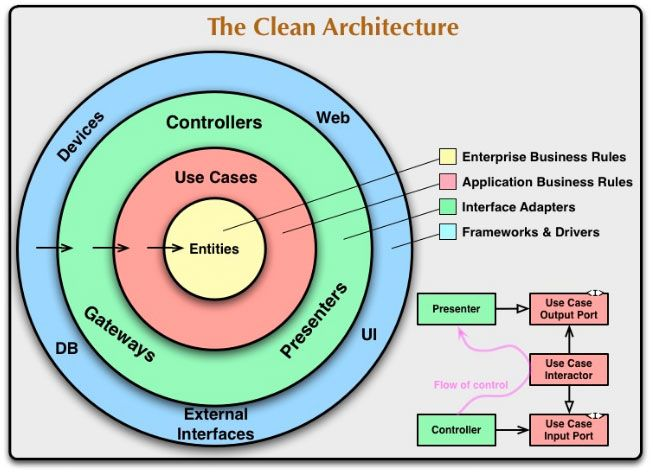
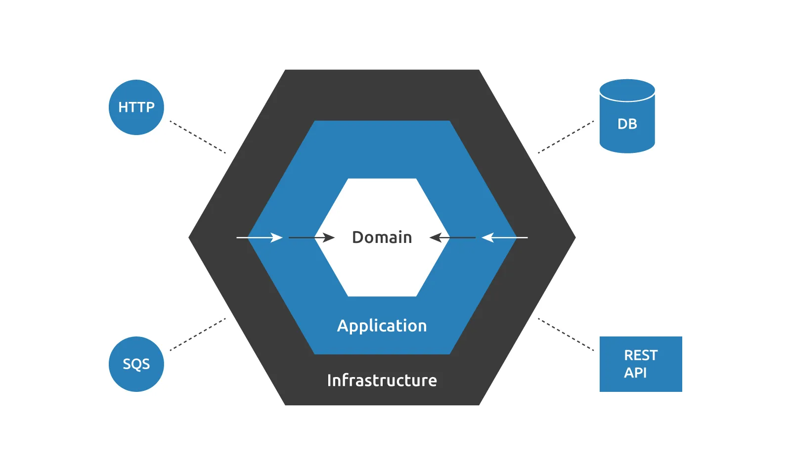
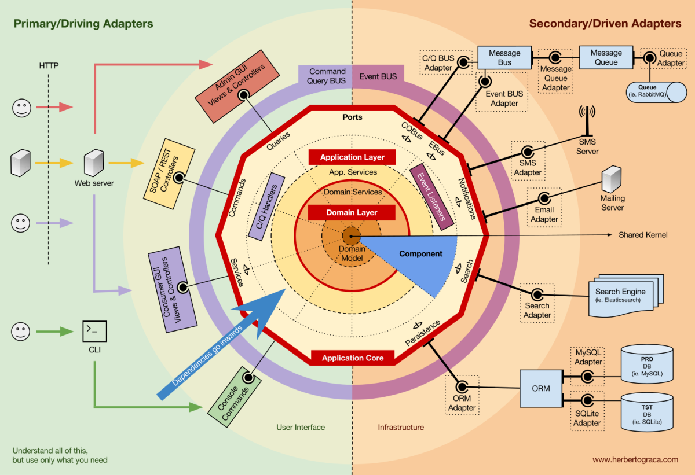

# Guía de Arquitecturas de Software

Clase de 100 minutos para personas sin experiencia previa en el tema.

---

## Mensaje principal

> La arquitectura de software es la forma en que organizamos un sistema para que sea entendible, mantenible, escalable y fácil de cambiar.

> No existe una arquitectura mejor para todo. Existe una arquitectura adecuada para un problema específico.

## Analogía inicial

- Código = ladrillos.
- Arquitectura = plano de construcción.
- Sin arquitectura: casa hecha por partes, sin saber dónde pasan tuberías, cables o columnas.
- Con arquitectura: se decide antes cómo se conectan las partes.

Programar sin arquitectura es como construir una casa poniendo cuartos donde quepan.
Programar con arquitectura es decidir primero dónde van cimientos, habitaciones, tuberías, electricidad y accesos.

## Objetivos de aprendizaje

Al terminar esta clase, los estudiantes podrán:

1. Explicar qué es arquitectura de software y por qué importa.
2. Reconocer los **cuatro ejes** sobre los que se toman decisiones arquitectónicas.
3. Identificar las arquitecturas más comunes y cuándo conviene cada una.
4. Saber qué preguntas hacer antes de elegir una arquitectura.
5. Entender que toda arquitectura tiene costos, no solo beneficios.

---

## Contenido

| Tiempo | Tema | Bloque |
|---:|---|---|
| 0 - 10 min  | ¿Qué es arquitectura? + los 4 ejes | Marco mental |
| 10 - 18 min | Giant Ball of Mud | Qué pasa sin arquitectura |
| 18 - 30 min | Cliente-servidor / Server / Serverless | Comunicación y despliegue |
| 30 - 45 min | Monolito / Modular / Capas | Organización interna básica |
| **45 min**  | **Recap rápido / pausa mental** | — |
| 45 - 62 min | Microservicios / Event-Driven | Sistemas distribuidos |
| 62 - 77 min | Batch / Streaming / Pipelines | Procesamiento de datos |
| 77 - 92 min | Clean / Hexagonal / CQRS | Arquitecturas avanzadas |
| 92 - 100 min| Comparación + cierre | Tabla, checklist, reglas |

> **Material complementario** (no se cubre en la clase pero queda como referencia): Plugins, ECS, IoT/sensores, Datos/ML/MLOps.

---

## Mapa mental: los 4 ejes de la arquitectura

Antes de meternos en nombres, hay que entender que las arquitecturas no son una lista plana. Son **decisiones tomadas en distintos ejes**, y un mismo sistema combina varios.

```text
EJE 1 — Comunicación              ¿Cómo hablan las partes entre sí?
   ├── Cliente-servidor
   ├── Peer-to-peer (Trackers)
   └── Event-driven

EJE 2 — Despliegue / ejecución    ¿Dónde y cómo corre el sistema?
   ├── Server
   ├── Serverless
   └── Microservicios

EJE 3 — Procesamiento             ¿Cómo se mueven los datos?
   ├── Batch
   ├── Streaming
   └── Pipelines

EJE 4 — Organización interna      ¿Cómo se estructura el código?
   ├── Monolito / Monolito modular
   ├── Capas
   ├── Clean
   ├── Hexagonal
   └── CQRS
```

> Un sistema real puede ser, por ejemplo: cliente-servidor (eje 1) + serverless (eje 2) + event-driven con pipelines (eje 3) + hexagonal (eje 4). Los ejes se combinan.

---

# ¿Qué es arquitectura?

## Puntos clave

- No es solo carpetas.
- No es solo diagramas.
- No es solo cloud.
- No es solo usar microservicios.
- Es tomar decisiones sobre cómo se divide, conecta, prueba y mantiene un sistema.

## Preguntas para lanzar al grupo

- ¿Qué pasa cuando un proyecto crece y nadie sabe dónde poner código nuevo?
- ¿Por qué a veces cambiar una línea rompe algo que parecía no tener relación?
- ¿Qué diferencia hay entre hacer que algo funcione y hacer que algo sea mantenible?
  - Mantenible se refiere a que sea **fácil de entender, corregir, modificar y extender sin romper otras partes**.

## Ideas que deben quedar claras

- Arquitectura = decisiones importantes y difíciles de cambiar.
- Toda arquitectura tiene ventajas y costos.
- La arquitectura debe responder al problema, no a una moda.

> **Transición:** *"Para que se entienda por qué esto importa, veamos primero qué pasa cuando NO hay arquitectura."*

---

# Giant Ball of Mud

## Cómo presentarlo

> Esto es lo que pasa cuando no hay arquitectura clara.

## Síntomas

- Todo depende de todo.
- Archivos enormes.
- Funciones que hacen muchas cosas.
- Código copiado y pegado.
- Variables globales.
- Nadie sabe dónde modificar.
- Cambios pequeños rompen cosas inesperadas.
- No hay pruebas.
- Hay miedo de tocar el código.

## Frases típicas (que probablemente han escuchado)

- "No toques eso porque se cae producción."
- "Eso lo hizo alguien que ya no está."
- "No sé por qué funciona, pero funciona."
- "Copiemos esta función y la adaptamos."

## Mensaje importante

> Un monolito no es malo. Un monolito desordenado puede convertirse en una bola de lodo.

## Pregunta para clase

- ¿Han visto un proyecto donde todo esté en `main.py`, `utils.py` o `final_final.py`?

> **Transición:** *"Bien. Ahora que sabemos qué evitar, empecemos por el primer eje: ¿cómo hablan las partes del sistema entre sí?"*

---

# Comunicación y despliegue

## Cliente-servidor (eje 1: comunicación)

> Cliente-servidor es una **arquitectura de comunicación o distribuida**, no necesariamente una arquitectura interna del código.
>
> Describe **cómo se reparten responsabilidades entre dos partes principales**: quien pide algo y quien lo procesa.

### Idea

Separar quien pide algo de quien lo procesa.

```text
Cliente → Servidor → Base de datos

Interfaz del simulador → Servidor de simulación → Resultados
```

### Ejemplos rápidos

- Navegador → API → Base de datos.
- App móvil → Backend → Base de datos.
- ESP32 → Servidor → Dashboard.
- Interfaz gráfica → Motor de simulación → Resultados.

### Puntos clave

- Es la base para entender backend.
- El cliente no debería tener toda la lógica.
- El servidor concentra procesamiento, reglas y datos.
- Puede ser simple, pero el servidor puede volverse cuello de botella.

### Pregunta para clase

- En una app de notas, ¿qué debería hacer el cliente y qué debería hacer el servidor?

---

## Server vs Serverless (eje 2: despliegue/ejecución)

Conceptos relacionados a mencionar de pasada: **Infrastructure as Code**, **Canary Deployment** (liberas la nueva versión solo a un pequeño porcentaje de usuarios), **Rolling Deployment** (actualizas poco a poco las instancias).

### Server

```text
Aplicación corriendo siempre en una máquina/contenedor/instancia.
```

**Ejemplos:** EC2, VPS, Docker, Kubernetes, servidor Linux, FastAPI/Django/Node corriendo permanentemente.

**Ventajas**

- Más control.
- Más fácil de entender.
- Proceso siempre vivo.
- Bueno para tráfico constante.

**Desventajas**

- Hay que administrar infraestructura.
- Hay costos aunque haya poco uso.
- Hay que escalar, monitorear y actualizar.

### Serverless

```text
Tú subes funciones; la nube administra servidores y ejecución.
```

**Ejemplo típico:**

```text
API Gateway → Lambda → DynamoDB
```

**Otros ejemplos:**

```text
Archivo en S3 → Lambda
Mensaje en SQS → Lambda
Evento programado → Lambda
```

**Ventajas**

- Escalado automático.
- Pago más cercano al uso.
- Muy bueno para eventos.
- Menos administración directa.

**Desventajas**

- Debug más difícil.
- Límites de ejecución.
- Dependencia del proveedor cloud.
- Cold starts.

### Cold Start (subtema de serverless)

> Tiempo extra que ocurre cuando una función serverless debe inicializarse antes de responder.

**Analogía:** es como llamar a alguien que estaba dormido: primero se despierta, se prepara y luego responde.

```text
Server:
Aplicación ya encendida → responde

Serverless:
Función dormida → inicia ambiente → ejecuta → responde
```

**Factores que afectan cold start:** lenguaje, tamaño del paquete, dependencias, conexión a base de datos, configuración de red, tiempo de inicialización.

### Mensaje clave del bloque

> Serverless no elimina el diseño arquitectónico; solo cambia el modelo de ejecución.

> **Transición:** *"Ya sabemos cómo se comunica el sistema y dónde corre. Ahora, ¿cómo está organizado el código por dentro?"*

---

# Organización interna básica

## Monolito

### Definición rápida

> Una sola aplicación contiene varias responsabilidades y se despliega junta.

### Ejemplo

```text
Sistema académico:
- Usuarios
- Cursos
- Inscripciones
- Notas
- Reportes
```

### Ventajas

- Fácil de iniciar.
- Fácil de desplegar al principio.
- Menos infraestructura.
- Ideal para equipos pequeños.
- Bueno si el dominio todavía está cambiando.

### Desventajas

- Puede crecer demasiado.
- Cambios pequeños pueden afectar todo.
- Escalado menos flexible.
- Puede convertirse en bola de lodo.

### Mensaje clave

> Un monolito bien organizado puede ser excelente.

### Pregunta para clase

- ¿Por qué no conviene iniciar todo proyecto con microservicios?

---

## Monolito modular

### Definición rápida

> Una sola aplicación, pero dividida internamente en módulos claros.

### Ejemplo

```text
app/
  students/
  courses/
  enrollments/
  grades/
  reports/
```

### Puntos clave

- Sigue siendo un solo despliegue.
- Pero el código tiene límites.
- Cada módulo tiene responsabilidad.
- Puede ser paso previo a microservicios.

### Ventajas

- Orden sin complejidad distribuida.
- Más fácil de probar.
- Más fácil de mantener.
- Buena opción para proyectos medianos.

### Advertencia

- Debe evitarse que todos los módulos accedan a todo.
- Evitar dependencias circulares.
- Evitar carpeta `utils` como basurero.

### Frase útil

> Antes de separar en microservicios, intenta separar bien dentro del monolito.

---

## Arquitectura por capas

el techo se apoya en las paredes, las paredes en los cimientos. Nunca al revés.

### Diagrama base

```text
Interfaz
   ↓
Aplicación / Servicios
   ↓
Dominio
   ↓
Datos / Infraestructura
```

### Versión simple para principiantes

```text
Interfaz → Lógica → Datos
```

### Qué va en cada capa

**Interfaz:** API, pantalla, CLI, Lambda handler, botón, endpoint.

**Aplicación / Servicios:** coordina casos de uso, llama dominio, llama repositorios, maneja flujo.

**Dominio:** reglas importantes, conceptos del negocio o problema, lo que no debería depender de frameworks.

**Datos / Infraestructura:** base de datos, archivos, APIs externas, sensores, cloud, S3, DynamoDB, PostgreSQL, CSV.


              ╔═══════════════════════════════════╗                                                                 
         1.   ║       INTERFAZ / PRESENTACIÓN     ║   ← lo que el mundo toca                                         
              ╠═══════════════════════════════════╣                                                                 
         2.   ║       APLICACIÓN / SERVICIOS      ║   ← coordina el flujo                                           
              ╠═══════════════════════════════════╣                                                                 
         3.   ║              DOMINIO              ║   ← reglas del problema                                         
              ╠═══════════════════════════════════╣                                                                 
         4.   ║      DATOS / INFRAESTRUCTURA      ║   ← BD, archivos, APIs
              ╚═══════════════════════════════════╝  

  La regla de oro                                           

    Las dependencias apuntan hacia abajo.
    Nunca hacia arriba.                                                                                                                                                   

  Esto significa:                                                                                                                                                         
  - La Interfaz puede llamar a Aplicación.                  
  - Aplicación puede llamar a Dominio y a Datos.                                                                                                                          
  - Dominio NO sabe que existe la base de datos.            
  - Dominio NO sabe si lo llama una API HTTP o un script.                                                                                                                 
  - Datos NO llama a la lógica de negocio.       


Principiantes: Interfaz - Logica - Datos

### Ejemplo corto

```text
Controller → Service → Domain → Repository → Database
```


  Cuándo SÍ usar capas                                                                                                                                                    
                                                                                                                                                                          
  - Cualquier proyecto que vaya a vivir más de unas semanas.                                                                                                              
  - Apps medianas o grandes.
  - Equipos donde varias personas tocan el mismo código.                                                                                                                  
  - Sistemas donde las reglas de negocio importan (banca, salud, académico).                                                                                              
                                                                                                                                                                          

  Cuándo NO vale la pena                                                                                                                                                  
                                                                                                                                                                          
  - Scripts de un solo archivo.                             

  - Notebooks de exploración.

  - Prototipos descartables.                                                                                                                                              

  - Hackatones donde el objetivo es funcionar en 24h.

    

# Antes de seguir, repasar mentalmente:

```text
Eje 1 (Comunicación)   → cliente-servidor
Eje 2 (Despliegue)     → server / serverless
Eje 4 (Organización)   → monolito → modular → capas
```

> *"Llevamos las arquitecturas más comunes y básicas. Ahora vamos a las que aparecen cuando el sistema crece o cuando hay sensores y eventos."*

Pausa mental opcional de 1-2 minutos.

---

# Sistemas distribuidos

- Sistema distribuido: cualquier sistema donde varios procesos en distintas máquinas hablan entre sí por la red para resolver 
- Todos los microservicios son sistemas distribuidos, pero no todos los sistemas distribuidos son microserviciosuna tarea.     

                           

## Microservicios

### Definición corta

> Dividir un sistema en servicios pequeños, independientes y desplegables por separado.

### Ejemplo

```text
Frontend
   ↓
API Gateway
   ↓
Users Service
Payments Service
Inventory Service
Notifications Service
Reports Service
```

### Ventajas

- Escalado independiente.
- Despliegue independiente.
- Equipos independientes.
- Aislamiento.
- Tecnologías diferentes.

### Costos

- Más infraestructura.
- Comunicación distribuida.
- Latencia.
- Fallos parciales.
- Observabilidad más difícil.
- Testing más difícil.
- Versionado de APIs.
- Consistencia eventual.

### Frase importante

> Microservicios no arreglan un mal diseño; pueden distribuir el desorden.

### Cuándo sí tiene sentido

- Equipos grandes.
- Dominios claramente separados.
- Necesidad real de escalar partes diferentes.
- Despliegues independientes.
- Buena madurez DevOps.
- Observabilidad y CI/CD.

### Pregunta para clase

- ¿Qué es más fácil de depurar: una aplicación o diez servicios hablando entre sí?

---

## Event-Driven Architecture

### Definición rápida

> El sistema reacciona a eventos: cosas que ocurrieron.

### Ejemplos de eventos

```text
UsuarioCreado
PagoRealizado
TemperaturaMedida
ArchivoSubido
SimulacionFinalizada
AlertaGenerada
```

### Diagrama

```text
Productor → Evento/Cola/Broker → Consumidor
```

### Ejemplo IoT

```text
Sensor mide temperatura
   ↓
Publica evento
   ↓
Broker/cola
   ↓
Guardar dato
   ↓
Verificar alerta
   ↓
Actualizar dashboard
```

### Tecnologías a mencionar

Kafka, RabbitMQ, MQTT, SQS, SNS, EventBridge.

### Ventajas

- Desacopla componentes.
- Bueno para sensores.
- Bueno para IoT.
- Bueno para procesamiento asíncrono.
- Permite agregar consumidores sin tocar productor.

### Costos

- Debug más difícil.
- Puede haber duplicados.
- Orden de eventos puede importar.
- Reintentos.
- Dead Letter Queue.
- Consistencia eventual.

### Concepto clave: idempotencia

> Si llega el mismo evento dos veces, no debería causar daño.

```text
PagoRealizado llega 2 veces → no debería cobrar 2 veces.
```

> **Transición:** *"Event-driven nos lleva naturalmente a la siguiente pregunta: ¿cómo procesamos esos datos? ¿De golpe o conforme llegan?"*

---

# Procesamiento de datos

## Batch vs Streaming

### Batch

```text
Procesar datos acumulados.
```

**Ejemplos:** procesar CSV al final del día, reporte diario, entrenamiento de modelo, análisis de experimento terminado.

### Streaming

```text
Procesar datos conforme llegan.
```

**Ejemplos:** sensor en tiempo real, alertas, telemetría, señales, monitoreo de laboratorio.

### Comparación rápida

| Aspecto     | Batch    | Streaming          |
| ----------- | -------- | ------------------ |
| Tiempo      | Después  | En tiempo real     |
| Complejidad | Menor    | Mayor              |
| Uso         | Reportes | Alertas / sensores |
| Latencia    | Alta     | Baja               |

---

## Arquitectura de pipelines

### Idea

Procesar por etapas.

```text
Entrada → Limpieza → Transformación → Procesamiento → Análisis → Salida
```

### Física / laboratorio

```text
Sensor → Filtro → Calibración → Cálculo → Almacenamiento → Gráfica
```

### Simulación

```text
Condiciones iniciales
→ Modelo físico
→ Solver numérico
→ Resultados
→ Análisis
→ Visualización
```

### Datos / ML

```text
Datos crudos
→ Validación
→ Limpieza
→ Features
→ Modelo
→ Evaluación
→ Despliegue
→ Monitoreo
```

### Ventajas

- Fácil de entender.
- Fácil de probar por etapas.
- Excelente para ciencia y datos.
- Permite reemplazar etapas.

### Preguntas para clase

- Si tengo un detector que debe alertar por temperatura alta, ¿batch o streaming?
- Si tengo un laboratorio que guarda mediciones de temperatura durante todo el día y al final genera un reporte promedio, ¿batch o streaming?
- Si un sensor de vibración debe detectar una falla en una máquina en el momento en que ocurre, ¿batch o streaming?
- Si tengo archivos CSV de varios experimentos y quiero limpiarlos, calibrarlos, calcular resultados y generar gráficas, ¿qué arquitectura de procesamiento usaría?
- Si quiero procesar datos de un telescopio o detector en varias etapas: lectura, filtrado, corrección de ruido, análisis y visualización, ¿cómo organizaría ese flujo usando pipelines?
- ¿Qué etapa cambiaría si quiero probar otro filtro de señal?

> **Transición:** *"Ahora vamos a las arquitecturas que aparecen cuando el dominio es lo suficientemente importante como para protegerlo de la infraestructura."*

---

# Arquitecturas avanzadas

## Clean Architecture

### Idea simple

> La lógica importante no debe depender de frameworks, bases de datos ni cloud.

### Diagrama conceptual

```text
Frameworks / DB / UI / External -> Cualquier recurso que pueda cambiarse
        ↓
Adapters -> Middleware
        ↓
Use Cases -> logica de aplicacion
        ↓
Domain -> Logica + entidades
```


### Regla

```text
Las dependencias apuntan hacia el centro.
```

### Ejemplo físico

```text
calcular_energia_cinetica(masa, velocidad)
```

No debería depender de: CSV, S3, Matplotlib, Flask, Lambda, PostgreSQL.

### Ventajas

- Más testeable.
- Menos acoplado.
- Más mantenible.
- Protege el dominio.

### Costo

- Más estructura.
- Más abstracciones.
- Puede ser demasiado para proyectos pequeños.

---

## Hexagonal Architecture

### También llamada

```text
Ports and Adapters
"No se llama hexagonal por tener seis cosas. Se llama así porque alguien lo dibujó como hexágono y se viralizó."
```

### Idea simple

> El dominio está al centro y se conecta al exterior mediante puertos y adaptadores.

### Términos

- **Dominio:** la lógica principal.
- **Casos de uso / Aplicacion**

- **Adaptador:** implementación concreta.
- **Puerto:** interfaz o contrato.

- **Infraestructura**
- **Actores Externos**





### Ejemplo

```text
Dominio: simular trayectoria

Puerto: ResultRepository

Adaptadores:
- CsvResultRepository
- DatabaseResultRepository
- S3ResultRepository
```

### Diagrama

```text
API / CLI / Test
      ↓
Adaptador de entrada
      ↓
Dominio
      ↓
Puerto de salida
      ↓
Adaptador a DB / CSV / S3
```

### Diferencia práctica con Clean

- Clean habla más de capas concéntricas.
- Hexagonal habla más de puertos y adaptadores.
- Ambas buscan desacoplar el dominio.

### Pregunta para clase

- ¿Qué debería cambiar si guardo resultados en CSV en vez de base de datos?

Respuesta esperada:

```text
Solo el adaptador, no la lógica principal.
```

---

## CQRS

### Significado

```text
Command Query Responsibility Segregation
```

### Idea

Separar:

```text
Commands → cambian estado
Queries  → leen estado
```

### Ejemplos

**Commands:**

```text
crear_usuario()
registrar_pago()
guardar_medicion()
iniciar_simulacion()
```

**Queries:**

```text
listar_usuarios()
consultar_resultados()
generar_reporte()
obtener_estado()
```

### Cuándo sirve

- Muchas lecturas.
- Reportes pesados.
- Sistemas event-driven.
- Lectura y escritura con necesidades diferentes.

### Advertencia

> No usar CQRS solo porque suena avanzado.

### Costo

- Más complejidad.
- Más modelos.
- Consistencia eventual.
- Posible duplicación.

---


## Comparación rápida
| Arquitectura | Cuándo sirve | Cuidado con |
|---|---|---|
| Monolito | Inicio, equipo pequeño | Desorden |
| Monolito modular | Sistema mediano | Límites débiles |
| Capas | Ordenar responsabilidades | Servicios gigantes |
| Serverless | Eventos/cloud | Cold start/límites |
| Microservicios | Equipos grandes/escala | Complejidad distribuida |
| Event-driven | IoT/eventos/asíncrono | Debug/reintentos |
| Batch | Reportes/históricos | Latencia |
| Streaming | Tiempo real | Complejidad |
| Clean | Dominio importante | Sobrediseño |
| Hexagonal | Aislar infraestructura | Abstracciones |
| CQRS | Lectura/escritura compleja | Consistencia eventual |
| Pipeline | Ciencia/datos | Rigidez |

## Frases clave para cierre

- La arquitectura debe servir al problema, no a la moda.
- Microservicios no son el punto de partida.
- Un monolito bien organizado puede ser una excelente decisión.
- Serverless no significa sin servidores.
- Event-driven es natural para sensores, eventos y sistemas asíncronos.
- En simulación, separar modelo, solver y visualización evita reescribir todo.
- Toda arquitectura tiene costo.
- Primero entender el problema, luego elegir la arquitectura.

## Checklist mental para elegir arquitectura

Antes de escoger, preguntar:

```text
¿El sistema es pequeño o grande?
¿Cuántas personas trabajan?
¿Necesita escalar?
¿Hay tiempo real?
¿Hay sensores?
¿Hay eventos?
¿Hay muchas lecturas?
¿Hay muchos módulos?
¿El dominio es complejo?
¿Debe ser fácil de probar?
¿El equipo puede operar sistemas distribuidos?
```

## Reglas rápidas

```text
Proyecto pequeño:
  Monolito + capas.

Proyecto mediano:
  Monolito modular.

Sensores/eventos:
  Event-driven.

Datos por etapas:
  Pipeline.

Tiempo real:
  Streaming.

Sistema científico:
  Modelo + solver + visualización separados.

Extensible:
  Plugins.

Muchas entidades:
  ECS.

Equipo grande + escala real:
  Microservicios.

Dominio crítico:
  Clean o Hexagonal.
```

## Último mensaje para estudiantes

> No se trata de memorizar nombres.
> Se trata de entender qué problema resuelve cada arquitectura y qué costo agrega.

---
---

# 📎 MATERIAL COMPLEMENTARIO

> Estos temas no se cubren en la clase de 100 minutos pero quedan como referencia para estudiantes que quieran profundizar, especialmente quienes trabajen en simulación, IoT o ciencia de datos.

---

## Arquitectura basada en plugins

### Idea

> Extender el sistema agregando módulos sin modificar el núcleo.

### Ejemplo

```text
Motor de simulación
  ├── Plugin gravedad
  ├── Plugin fricción
  ├── Plugin colisiones
  ├── Plugin campo eléctrico
  └── Plugin exportar CSV
```

### Cuándo usar

- Simuladores.
- Software científico.
- Herramientas educativas.
- Sistemas donde se esperan extensiones.
- Diferentes modelos físicos o numéricos.

### Ventajas

- Extensible.
- Flexible.
- Permite agregar nuevas funciones.
- Núcleo más estable.

### Costo

- Requiere interfaces claras.
- Compatibilidad entre plugins.
- Más diseño inicial.

---

## Entity Component System (ECS) para simulación

### Idea

Muy usado en videojuegos y simuladores.

```text
Entidad + Componentes + Sistemas
```

**Entidad:** algo que existe (partícula, planeta, robot, sensor virtual, vehículo).

**Componente:** datos (posición, velocidad, masa, carga, temperatura).

**Sistema:** lógica que procesa componentes (GravitySystem, CollisionSystem, IntegrationSystem, RenderingSystem).

### Ejemplo

```text
Partícula 1:
- Position
- Velocity
- Mass
- Charge

Sistemas:
- Gravedad
- Integración
- Visualización
```

### Cuándo mencionarlo

- Muchas entidades.
- Simulación visual.
- Videojuegos.
- Sistemas físicos con muchos objetos.
- Comportamiento flexible.

### Costo

- Más difícil que OOP simple.
- Puede ser demasiado para simulaciones pequeñas.

---

## Arquitectura para IoT / sensores

### Diagrama

```text
Sensor
   ↓
Microcontrolador
   ↓
Comunicación
   ↓
Backend
   ↓
Base de datos
   ↓
Dashboard / Alertas
```

### Ejemplo

```text
DHT22 / MPU6050
   ↓
ESP32
   ↓
MQTT
   ↓
Broker
   ↓
Procesador de eventos
   ↓
Time-series database
   ↓
Dashboard
```

### Decisiones clave

- ¿Procesar en el dispositivo o en backend?
- ¿HTTP, MQTT, LoRa, UART?
- ¿Qué pasa si se pierde conexión?
- ¿Se necesita tiempo real?
- ¿Cómo calibrar sensores?
- ¿Cómo identificar dispositivos?
- ¿Cómo generar alertas?
- ¿Cómo guardar históricos?

### Arquitectura recomendada

```text
Event-driven + pipeline + dashboard
```

---

## Arquitectura para datos / ML / MLOps

### Pipeline de datos

```text
Extracción
→ Validación
→ Limpieza
→ Transformación
→ Almacenamiento
→ Consumo
```

### Pipeline ML

```text
Datos históricos
→ Features
→ Entrenamiento
→ Evaluación
→ Registro del modelo
→ Despliegue
→ Monitoreo
→ Reentrenamiento
```

### Tipos de inferencia

**Online:**

```text
API → Modelo → Respuesta inmediata
```

**Batch:**

```text
Archivo/lote → Predicciones → Reporte
```

**Event-driven:**

```text
Evento → Cola → Modelo → Resultado
```

### Puntos para mencionar

- Feature store.
- Model registry.
- Drift.
- Monitoreo.
- Reentrenamiento.
- CI/CD.
- Separar entrenamiento de inferencia.
